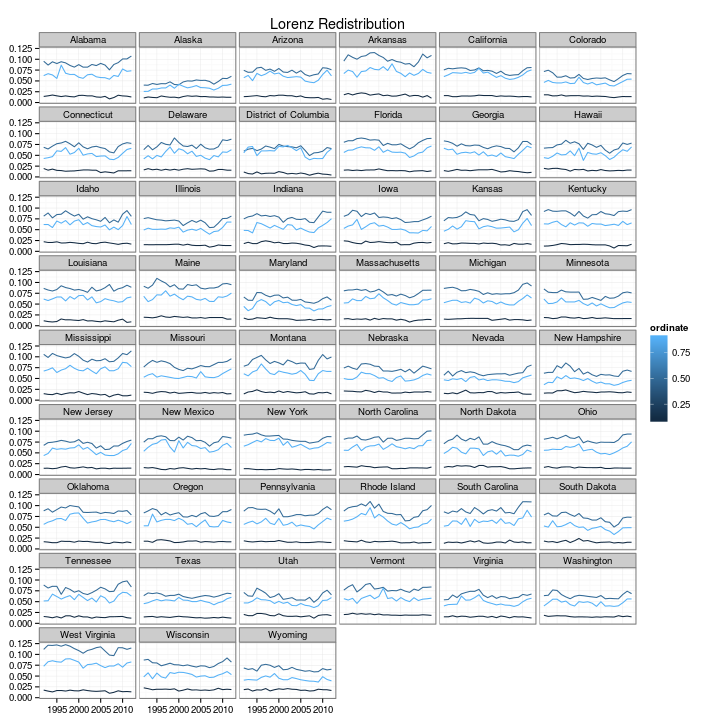
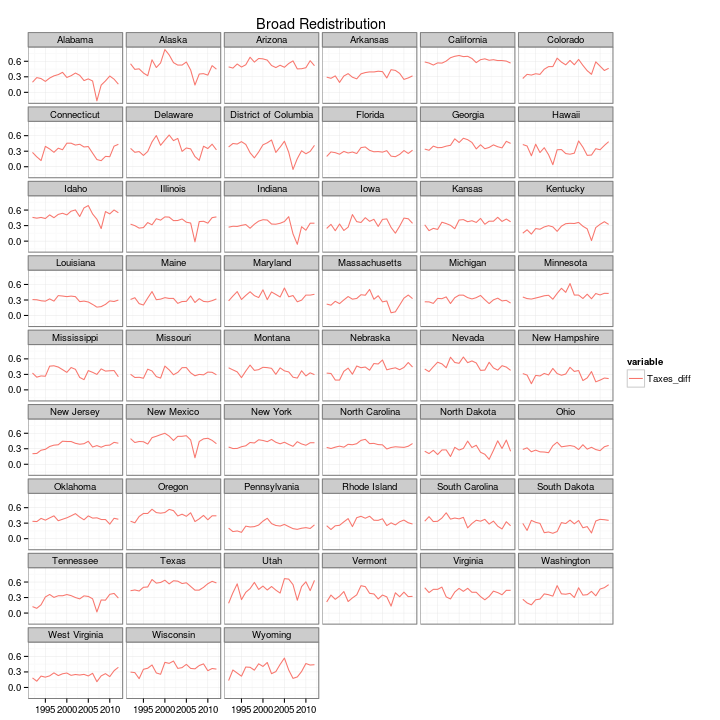

Exploratory Analysis of State Variation in The Redistributiveness of Policy
========================================================


Significant parts of the social safety net (e.g. Medicaid) are implemented at the State rather than national level. Additionally, there are redistributive tax policies at both the State and local levels that interact with the Federal income tax-and-transfer system. In practice then, the redistributive state is slightly different in each State (to abuse nomenclature). Examining what the redistributive state is doing in practice is then worth looking at. 

A rough measure of redistributiveness is the redistributive index: $RE_i = G_i\left(I_{M, i}\right) - G_i\left(I_{D, i}\right)$, where $i$ indexes states, $M$ denotes market income (pre-tax, pre-transfer), and $D$ denotes disposable income (post-tax, post-transfer). $G$ is a scalar inequality index (canonically, the Gini, although any other index will work.) One would hope that the index to be used satisfies the usual properties (e.g. the Pigou-Dalton principle.) Consider first inequality metrics using the standard cellmean imputed income from the CPS:

```r
print(ggplot(pre_post_trunc, aes(x = year, y = value, group = variable, colour = variable)) + 
    labs(title = "Redistributiveness") + xlab(NULL) + ylab(NULL) + theme(axis.text.x = element_text(angle = 60, 
    size = 12)) + theme_bw() + geom_line() + facet_wrap(~State, ncol = 6))
```

 


```r
print(ggplot(pre_post_rawtrunc, aes(x = year, y = value, group = variable, colour = variable)) + 
    labs(title = "Gini 'Decompositions'") + xlab(NULL) + ylab(NULL) + theme(axis.text.x = element_text(angle = 60, 
    size = 12)) + theme_bw() + geom_line() + facet_wrap(~State, ncol = 6))
```

 


Let's look at one state: California

```r
NY <- subset(pre_post, pre_post$State == "California")
ggplot(NY, aes(year)) + geom_line(aes(y = pretax_gini, colour = "Pretax Gini")) + 
    geom_line(aes(y = posttax_gini, colour = "Posttax Gini"))
```

 


Note that given the way the CPS topcoding works, inequality measures that use the cellmean imputed incomes will be baised downwards. One approach (adapted in Voorheis (2013) from Jenkins et al (2011)) is to parametrically fit the tail of the distribution and then perform simulation-based multiple imputation. Inequality metrics using this process can then be used to measure redistributiveness:


```r
gini_redist <- multi_ineq[, 1:2]
gini_redist$cellmean_redist <- (multi_ineq$cellmean_gini_pre - multi_ineq$cellmean_gini_post)/multi_ineq$cellmean_gini_pre
gini_redist$GB2_redist <- (multi_ineq$CPS_gini_pre - multi_ineq$CPS_gini_post)/multi_ineq$CPS_gini_pr
gini_redist <- melt(gini_redist, id.vars = c("State", "year"))
gini_raw <- multi_ineq[, c(1:2, 17, 31, 59, 65)]
gini_raw <- melt(gini_raw, id.vars = c("State", "year"))
```


```r
print(ggplot(gini_redist, aes(x = year, y = value, group = variable, colour = variable)) + 
    labs(title = "Redistributiveness") + xlab(NULL) + ylab(NULL) + theme(axis.text.x = element_text(angle = 60, 
    size = 12)) + theme_bw() + geom_line() + facet_wrap(~State, ncol = 6))
```

 


```r
print(ggplot(gini_raw, aes(x = year, y = value, group = variable, colour = variable)) + 
    labs(title = "Redistributiveness") + xlab(NULL) + ylab(NULL) + theme(axis.text.x = element_text(angle = 60, 
    size = 12)) + theme_bw() + geom_line() + facet_wrap(~State, ncol = 6))
```

 


Suppose instead we are interested in the entire income distribution, rather than a scalar summary of inequality. One way of moving into multidimensional conceptions of redistributiveness would be to examine the difference in Lorenz curve ordinates before and after policy intervention (i.e.f or pre-tax, pre-transfer incomes and post-tax, post-transfer incomes.)


```r
load("/media/john/Shared Linux_Windows Files/MSA Level Inequality/Data/pre_post_cellmean_lorenz.rda")
pre_post_lorenz <- subset(pre_post_lorenz, pre_post_lorenz$year < 2013)
pre_post_lorenz$redist <- pre_post_lorenz$posttax_lorenz - pre_post_lorenz$pretax_lorenz
pre_post_lorenz$redist_pct <- (pre_post_lorenz$posttax_lorenz - pre_post_lorenz$pretax_lorenz)/(pre_post_lorenz$posttax_lorenz)
pre_post_lorenz1 <- subset(pre_post_lorenz, pre_post_lorenz$ordinate == 0.1 | 
    pre_post_lorenz$ordinate == 0.5 | pre_post_lorenz$ordinate == 0.9)
pre_post_lorenz5 <- subset(pre_post_lorenz, pre_post_lorenz$ordinate == 0.5)
pre_post_lorenz9 <- subset(pre_post_lorenz, pre_post_lorenz$ordinate == 0.9)
```

So for instance, we can examine state-level variation at the $p=\left\lbrace 0.1, 0.5, 0.9\right\rbrace$ Lorenz ordinates, across time, or examine the variation within state-years across ordinates.


```r
print(ggplot(pre_post_lorenz1, aes(x = year, y = redist, group = ordinate, colour = ordinate)) + 
    labs(title = "Lorenz Redistribution") + xlab(NULL) + ylab(NULL) + theme(axis.text.x = element_text(angle = 60, 
    size = 12)) + theme_bw() + geom_line() + facet_wrap(~State, ncol = 6))
```

 


```r
CA <- subset(pre_post_lorenz, pre_post_lorenz$State == "California" & pre_post_lorenz$year > 
    2005)
ggplot(CA, aes(x = ordinate, y = redist, group = year, colour = year)) + geom_line()
```

 


Now, let's try a similar set of exercises with broader definitions of income. Consider a variation of the Haigs-Simons definition of income, similar to Armour, Larrimore and Burkhauser (2013). Define broad pre-intervention income to be the sum of market income (wages, dividends, interest, rents, etc.), the pre-property tax return on home equity, and the value of employer-provided health insurance. (We can also consider annual accruals to capital gains, but that is beyond the scope of this setting.) We can then define post-intervention income as pre-intervention income, less federal and state income taxes, property taxes and payroll (FICA) taxes, plus cash transfers, the imputed value of in-kind transfers (e.g. food stamps) and the fungible value of Medicaid and Medicare.


```r
setwd("/media/john/Shared Linux_Windows Files/MSA Level Inequality")
load("Data/Broad_income_gini_ind.rda")
broad_redist$narrow_redist <- (broad_redist$Gini_pretax - broad_redist$Gini_posttax)
broad_redist$broad_redist <- (broad_redist$Gini_pretax_broad - broad_redist$Gini_posttax_broad)
broad_redist_melt <- data.frame(State = broad_redist$statefip, year = broad_redist$year, 
    broad_redist = broad_redist$broad_redist, narrow_redist = broad_redist$narrow_redist)
broad_redist_melt <- melt(broad_redist_melt, id.vars = c("State", "year"))
broad_ineq <- data.frame(State = broad_redist$statefip, year = broad_redist$year, 
    Gini_pretax = broad_redist$Gini_pretax, Gini_posttax = broad_redist$Gini_posttax, 
    Gini_pretax_broad = broad_redist$Gini_pretax_broad, Gini_posttax_broad = broad_redist$Gini_posttax_broad)
broad_ineq <- melt(broad_ineq, id.vars = c("State", "year"))
```


```r
print(ggplot(broad_redist_melt, aes(x = year, y = value, group = variable, colour = variable)) + 
    labs(title = "Broad Redistribution") + xlab(NULL) + ylab(NULL) + theme(axis.text.x = element_text(angle = 60, 
    size = 12)) + theme_bw() + geom_line() + facet_wrap(~State, ncol = 6))
```

 


```r
print(ggplot(broad_ineq, aes(x = year, y = value, group = variable, colour = variable)) + 
    labs(title = "Broad Redistribution") + xlab(NULL) + ylab(NULL) + theme(axis.text.x = element_text(angle = 60, 
    size = 12)) + theme_bw() + geom_line() + facet_wrap(~State, ncol = 6))
```

 


Now suppose we broaden the income definition further to allow for yearly accrual of real estate capital gains (e.g. home equity) but not other forms of capital gains. This should line up with the most expansive Census Bureau definition of income.


```r
setwd("/media/john/Shared Linux_Windows Files/MSA Level Inequality")
load("Data/Broad_income_gini_ind.rda")
broad_redist$narrow_redist <- (broad_redist$Gini_pretax - broad_redist$Gini_posttax)
broad_redist$broad_redist <- (broad_redist$Gini_pretax_equity - broad_redist$Gini_posttax_equity)
broad_redist_melt <- data.frame(State = broad_redist$statefip, year = broad_redist$year, 
    broad_redist = broad_redist$broad_redist, narrow_redist = broad_redist$narrow_redist)
broad_redist_melt <- melt(broad_redist_melt, id.vars = c("State", "year"))
broad_ineq <- data.frame(State = broad_redist$statefip, year = broad_redist$year, 
    Gini_pretax = broad_redist$Gini_pretax, Gini_posttax = broad_redist$Gini_posttax, 
    Gini_pretax_broad = broad_redist$Gini_pretax_broad, Gini_posttax_broad = broad_redist$Gini_posttax_broad)
broad_ineq <- melt(broad_ineq, id.vars = c("State", "year"))
```


```r
print(ggplot(broad_redist_melt, aes(x = year, y = value, group = variable, colour = variable)) + 
    labs(title = "Broad Redistribution") + xlab(NULL) + ylab(NULL) + theme(axis.text.x = element_text(angle = 60, 
    size = 12)) + theme_bw() + geom_line() + facet_wrap(~State, ncol = 6))
```

 


```r
print(ggplot(broad_ineq, aes(x = year, y = value, group = variable, colour = variable)) + 
    labs(title = "Broad Redistribution") + xlab(NULL) + ylab(NULL) + theme(axis.text.x = element_text(angle = 60, 
    size = 12)) + theme_bw() + geom_line() + facet_wrap(~State, ncol = 6))
```

 


For the above, we're using individual equivalent income, what if we use size-adjusted household income instead?


```r
setwd("/media/john/Shared Linux_Windows Files/MSA Level Inequality")
load("Data/Broad_income_gini.rda")
broad_redist$narrow_redist <- (broad_redist$Gini_pretax - broad_redist$Gini_posttax)
broad_redist$broad_redist <- (broad_redist$Gini_pretax_broad - broad_redist$Gini_posttax_broad)
broad_redist_melt <- data.frame(State = broad_redist$State, year = broad_redist$year, 
    broad_redist = broad_redist$broad_redist, narrow_redist = broad_redist$narrow_redist)
broad_redist_melt <- melt(broad_redist_melt, id.vars = c("State", "year"))
broad_ineq <- data.frame(State = broad_redist$State, year = broad_redist$year, 
    Gini_pretax = broad_redist$Gini_pretax, Gini_posttax = broad_redist$Gini_posttax, 
    Gini_pretax_broad = broad_redist$Gini_pretax_broad, Gini_posttax_broad = broad_redist$Gini_posttax_broad)
broad_ineq <- melt(broad_ineq, id.vars = c("State", "year"))
```


```r
print(ggplot(broad_redist_melt, aes(x = year, y = value, group = variable, colour = variable)) + 
    labs(title = "Broad Redistribution") + xlab(NULL) + ylab(NULL) + theme(axis.text.x = element_text(angle = 60, 
    size = 12)) + theme_bw() + geom_line() + facet_wrap(~State, ncol = 6))
```

 


```r
print(ggplot(broad_ineq, aes(x = year, y = value, group = variable, colour = variable)) + 
    labs(title = "Broad Redistribution") + xlab(NULL) + ylab(NULL) + theme(axis.text.x = element_text(angle = 60, 
    size = 12)) + theme_bw() + geom_line() + facet_wrap(~State, ncol = 6))
```

 


Alternatively: Consider the difference that in-kind transfers make:

```r
setwd("/media/john/Shared Linux_Windows Files/MSA Level Inequality")
load("Data/Broad_income_gini_ind.rda")
broad_redist$narrow_redist <- (broad_redist$Gini_pretax - broad_redist$Gini_posttax)
broad_redist$broad_redist <- (broad_redist$Gini_pretax_equity - broad_redist$Gini_posttax_equity)
broad_redist$in_kind_diff <- broad_redist$broad_redist - broad_redist$narrow_redist
broad_redist_melt <- data.frame(State = broad_redist$statefip, year = broad_redist$year, 
    In_kind_diff = broad_redist$in_kind_diff)
broad_redist_melt <- melt(broad_redist_melt, id.vars = c("State", "year"))
```


```r
print(ggplot(broad_redist_melt, aes(x = year, y = value, group = variable, colour = variable)) + 
    labs(title = "Broad Redistribution") + xlab(NULL) + ylab(NULL) + theme(axis.text.x = element_text(angle = 60, 
    size = 12)) + theme_bw() + geom_line() + facet_wrap(~State, ncol = 6))
```

 


Or taxes:

```r
setwd("/media/john/Shared Linux_Windows Files/MSA Level Inequality")
load("Data/Broad_income_gini_ind.rda")
broad_redist$narrow_redist <- (broad_redist$Gini_pretax - broad_redist$Gini_posttax)
broad_redist$broad_redist <- (broad_redist$Gini_pretax - broad_redist$Gini_postpre)
broad_redist$in_kind_diff <- broad_redist$broad_redist/broad_redist$narrow_redist
broad_redist_melt <- data.frame(State = broad_redist$statefip, year = broad_redist$year, 
    Taxes_diff = broad_redist$in_kind_diff)
broad_redist_melt <- melt(broad_redist_melt, id.vars = c("State", "year"))
```


```r
print(ggplot(broad_redist_melt, aes(x = year, y = value, group = variable, colour = variable)) + 
    labs(title = "Broad Redistribution") + xlab(NULL) + ylab(NULL) + theme(axis.text.x = element_text(angle = 60, 
    size = 12)) + theme_bw() + geom_line() + facet_wrap(~State, ncol = 6))
```

 


```r
MA <- subset(broad_redist_melt, broad_redist_melt$State == "Colorado")
print(ggplot(MA, aes(x = year, y = value, group = variable, colour = variable)) + 
    labs(title = "Broad Redistribution") + geom_line())
```

 

