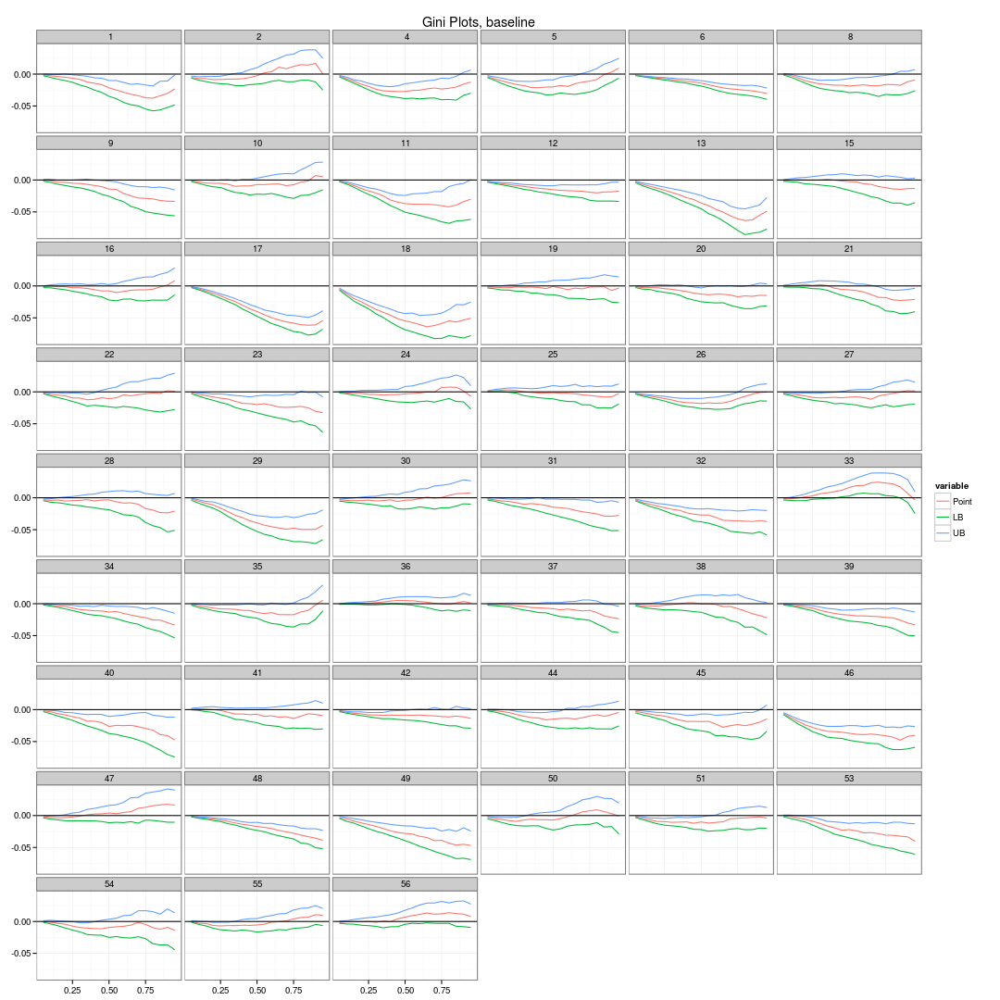

Broad_gini
========================================================

```r
library(reldist)
```

```
## reldist: Relative Distribution Methods
## Version 1.6-2 created on 2013-03-03.
## copyright (c) 2003, Mark S. Handcock, University of California-Los Angeles
##  For citation information, type citation("reldist").
##  Type help(package="reldist") to get started.
```

```r
library(plyr)
library(reshape)
```

```
## 
## Attaching package: 'reshape'
## 
## The following objects are masked from 'package:plyr':
## 
##     rename, round_any
```

```r
library(ggplot2)
setwd("/media/john/Shared Linux_Windows Files/MSA Level Inequality/")
load("simplified_broad_inc.rda")

broad_inc_gini <- ddply(broad_inc, .variables = c("State", "year"), function(x) c(cell_gini = gini(x$cellmean_equivinc), 
    broad_pre_gini = gini(x$equivinc_pretax_broad), broad_post_gini = gini(x$equivinc_posttax_broad)))

broad_inc_gini <- melt(broad_inc_gini, id.vars = c("State", "year"))
```


```r
print(ggplot(broad_inc_gini, aes(x = year, y = value, group = variable, colour = variable)) + 
    labs(title = "Gini Plots") + xlab(NULL) + ylab(NULL) + theme(axis.text.x = element_text(angle = 60, 
    size = 12)) + theme_bw() + geom_line() + facet_wrap(~State, ncol = 6))
```

 


```r
load("/media/john/Shared Linux_Windows Files/MSA Level Inequality/Data/cellmean_LC_ordtest.rda")
cellmean_LC <- melt(cellmean_LC, id.vars = c("State", "year_1", "year_2", "ord"))
cutoff <- data.frame(x = c(-Inf, Inf), y = 0, cutoff = factor(0))
print(ggplot(cellmean_LC, aes(x = ord, y = value, group = variable, colour = variable)) + 
    labs(title = "Gini Plots, baseline") + xlab(NULL) + ylab(NULL) + theme(axis.text.x = element_text(angle = 60, 
    size = 12)) + theme_bw() + geom_line() + geom_hline(aes(yintercept = 0)) + 
    facet_wrap(~State, ncol = 6))
```

 


```r
load("/media/john/Shared Linux_Windows Files/MSA Level Inequality/Data/broad_pre_LC_ordtest.rda")
cellmean_LC <- melt(broad_pre_LC, id.vars = c("State", "year_1", "year_2", "ord"))
cutoff <- data.frame(x = c(-Inf, Inf), y = 0, cutoff = factor(0))
print(ggplot(cellmean_LC, aes(x = ord, y = value, group = variable, colour = variable)) + 
    labs(title = "Gini Plots, pre-tax (broad)") + xlab(NULL) + ylab(NULL) + 
    theme(axis.text.x = element_text(angle = 60, size = 12)) + theme_bw() + 
    geom_line() + geom_hline(aes(yintercept = 0)) + facet_wrap(~State, ncol = 6))
```

 


```r
load("/media/john/Shared Linux_Windows Files/MSA Level Inequality/Data/broad_post_LC_ordtest.rda")
cellmean_LC <- melt(broad_post_LC, id.vars = c("State", "year_1", "year_2", 
    "ord"))
print(ggplot(cellmean_LC, aes(x = ord, y = value, group = variable, colour = variable)) + 
    labs(title = "Gini Plots, post-tax (broad)") + xlab(NULL) + ylab(NULL) + 
    theme(axis.text.x = element_text(angle = 60, size = 12)) + theme_bw() + 
    geom_line() + geom_hline(aes(yintercept = 0)) + facet_wrap(~State, ncol = 6))
```

 


```r
load("/media/john/Shared Linux_Windows Files/MSA Level Inequality/Data/cellmean_LC_perctest.rda")
cellmean_LC <- melt(cellmean_LC, id.vars = c("State", "year_1", "year_2", "ord"))
cutoff <- data.frame(x = c(-Inf, Inf), y = 0, cutoff = factor(0))
print(ggplot(cellmean_LC, aes(x = ord, y = value, group = variable, colour = variable)) + 
    labs(title = "Gini Plots, baseline") + xlab(NULL) + ylab(NULL) + theme(axis.text.x = element_text(angle = 60, 
    size = 12)) + theme_bw() + geom_line() + geom_hline(aes(yintercept = 0)) + 
    facet_wrap(~State, ncol = 6))
```

 


```r
load("/media/john/Shared Linux_Windows Files/MSA Level Inequality/Data/broad_pre_LC_perctest.rda")
cellmean_LC <- melt(broad_pre_LC, id.vars = c("State", "year_1", "year_2", "ord"))
cutoff <- data.frame(x = c(-Inf, Inf), y = 0, cutoff = factor(0))
print(ggplot(cellmean_LC, aes(x = ord, y = value, group = variable, colour = variable)) + 
    labs(title = "Gini Plots, pre-tax (broad)") + xlab(NULL) + ylab(NULL) + 
    theme(axis.text.x = element_text(angle = 60, size = 12)) + theme_bw() + 
    geom_line() + geom_hline(aes(yintercept = 0)) + facet_wrap(~State, ncol = 6))
```

 


```r
load("/media/john/Shared Linux_Windows Files/MSA Level Inequality/Data/broad_post_LC_perctest.rda")
cellmean_LC <- melt(broad_post_LC, id.vars = c("State", "year_1", "year_2", 
    "ord"))
print(ggplot(cellmean_LC, aes(x = ord, y = value, group = variable, colour = variable)) + 
    labs(title = "Gini Plots, post-tax (broad)") + xlab(NULL) + ylab(NULL) + 
    theme(axis.text.x = element_text(angle = 60, size = 12)) + theme_bw() + 
    geom_line() + geom_hline(aes(yintercept = 0)) + facet_wrap(~State, ncol = 6))
```

 

