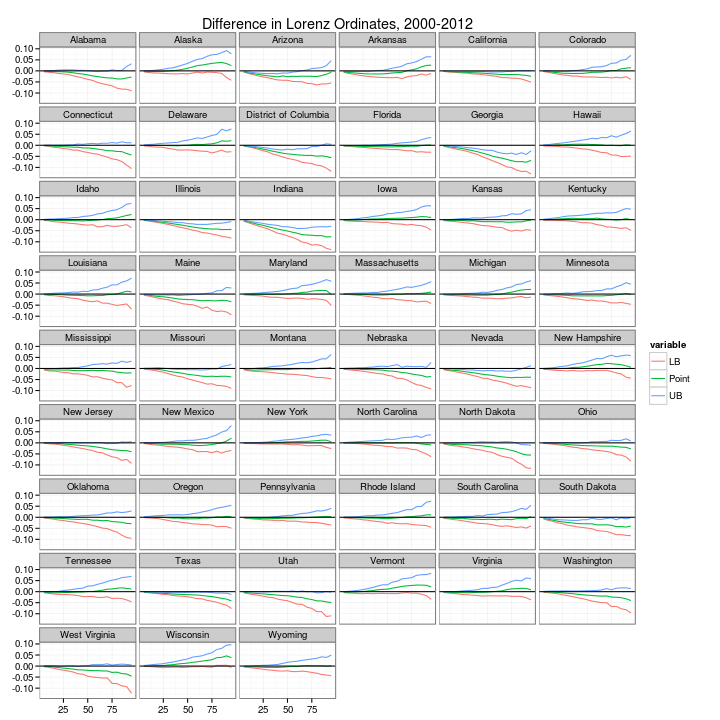
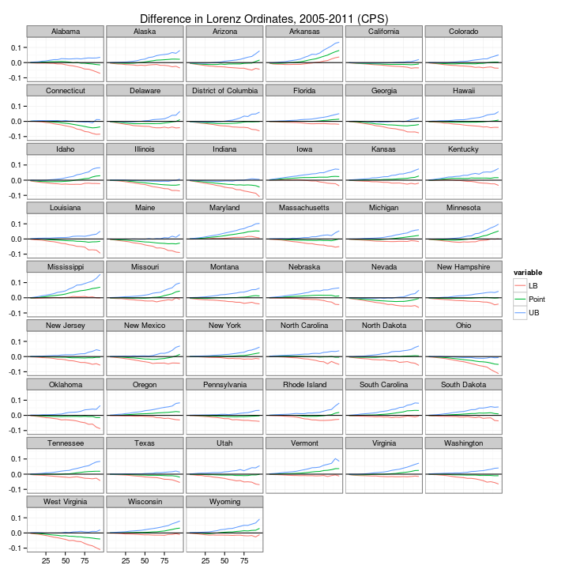
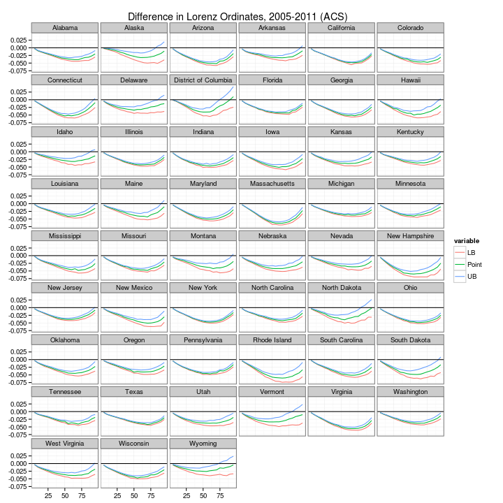

State Level Variation in the Redistributiveness of Policy: 1992-2013
========================================================

Using CPS microdata, we can think of household income as being defined by one of 4 distinct income concepts - pre-tax, pre-transfer income; pre-tax, post-transfer income; post-tax, pre-transfer income, and post-tax, post-transfer income. The middle two income concepts line up the the CPS default and the income concept used in most IRS tax return based studies of the income distribution. The first concept can be thought of as pre-intervention income (although note that, given the literature on the ETI, this income concept is endogeneous with policy.) The last concept certainly measures income after all direct state redistributive policy has occurred (although note that policies that do not directly affect income such as sales taxes are not counted). 
  
We can estimate scalar inequality measures (e.g. the Gini coefficient) for these two measures, and the difference between these estimates can be thought of a measure of how redistributive policy is in practice. If we are interested in state level variation in redistribution, then this raw difference needs to take into account differences in the level of inequality across states. A suitable normalization might be the percentage change in inequality from pre-tax, pre-transfer incomes to post-tax, post-transfer incomes, i.e. $G_{diff} = \frac{G_{pre}-G_{post}}{G_{pre}}$. 


```r
library(ineq)
suppressPackageStartupMessages(require(reldist))
library(ggplot2)
library(xtable)
# Load in data (previously generated) and generate redistributiveness
# measures
load("/media/john/Shared Linux_Windows Files/MSA Level Inequality/Data/pre_vs_post_tax_gini.rda")
pre_post$diff_test <- (pre_post$posttax_gini - pre_post$pretax_gini)/sqrt(pre_post$posttax_gini_var + 
    pre_post$pretax_gini_var)
pre_post$diff_est <- (pre_post$pretax_gini - pre_post$posttax_gini)
pre_post$diff_est_pct <- (pre_post$pretax_gini - pre_post$posttax_gini)/pre_post$pretax_gini
```

Looking at a specific state (e.g. New York) as an example, we can first examine the composition of the redistribution by visually inspecting the pre and post policy inequality measures.

```r
NY <- subset(pre_post, pre_post$State == "New York")
ggplot(NY, aes(year)) + geom_line(aes(y = pretax_gini, colour = "pre-tax Gini")) + 
    geom_line(aes(y = posttax_gini, colour = "post-tax Gini")) + geom_linerange(aes(ymin = posttax_gini, 
    ymax = pretax_gini))
```

 


And then, we can examine the raw and percent differences in inequality. We can see, e.g., that there is a cyclical increase in redistribution coinciding with the Great Recession. But, interestingly, there is a sharp uptick in post-tax, post-transfer inequality from 2012 to 2013. A scalar inequality measure like the Gini coefficient is unable to tell us exactly where on the income distribution these changes in redistribution are occurring. 


```r
ggplot(NY, aes(x = year)) + geom_line(aes(y = diff_est, colour = "Raw Difference")) + 
    geom_line(aes(y = diff_est_pct, colour = "Percent Difference"))
```

 


```r
load("/media/john/Shared Linux_Windows Files/MSA Level Inequality/Data/CPS_household_tax.rda")
NY_2012 <- subset(CPS.work.hh, CPS.work.hh$State == "New York" & CPS.work.hh$year == 
    2012)
NY_2013 <- subset(CPS.work.hh, CPS.work.hh$State == "New York" & CPS.work.hh$year >= 
    2013)
plot(Lc(NY_2012$cellmean_equivinc_pretrans), main = "Lorenz Curve Pre/Post Policy, 2012")
lines(Lc(NY_2012$cellmean_equivinc_posttax), col = 2)
```

 


```r
plot(Lc(NY_2013$cellmean_equivinc_pretrans), main = "Lorenz Curve Pre/Post Policy, 2013")
lines(Lc(NY_2013$cellmean_equivinc_posttax), col = 2)
```

 


```r
plot(Lc(NY_2012$cellmean_equivinc_posttax), main = "Lorenz Curve Post Policy, 2012-3")
lines(Lc(NY_2013$cellmean_equivinc_posttax), col = 2)
```

 


```r
plot(Lc(NY_2012$cellmean_equivinc_pretrans), main = "Lorenz Curve Pre Policy, 2012-3")
lines(Lc(NY_2013$cellmean_equivinc_pretrans), col = 2)
```

 


It seems as though the changes are occurring in the bottom half of the income distribution. Mere visual inspection is insufficient to fully answer this question, however. Although I have in the past argued for the superiority of non-parametric inference in re: Lorenz dominance, the parametric approach may actually be helpful here, in that it compares a finite number of specific Lorenz ordinates.


So if we do a set of pairwise tests for Lorenz Ordinates $p=\left\lbrace 0, 0.05, ..., 0.95, 1\right\rbrace$, we can examine where on the income distribution the 2012-2013 increase in inequality is occurring. First, we examine the difference between post-tax, post-transfer incomes in 2012-2013:


```r
print(xtable(results, digits = 5), type = "html")
```

<!-- html table generated in R 3.0.2 by xtable 1.7-1 package -->
<!-- Mon Nov  4 14:15:41 2013 -->
<TABLE border=1>
<TR> <TH>  </TH> <TH> Ordinate </TH> <TH> Difference </TH> <TH> Lower_Bound </TH> <TH> Upper_Bound </TH>  </TR>
  <TR> <TD align="right"> 1 </TD> <TD align="right"> 0.01000 </TD> <TD align="right"> 0.00000 </TD> <TD align="right"> 0.00000 </TD> <TD align="right"> 0.00000 </TD> </TR>
  <TR> <TD align="right"> 2 </TD> <TD align="right"> 0.10000 </TD> <TD align="right"> -0.00268 </TD> <TD align="right"> -0.00470 </TD> <TD align="right"> -0.00067 </TD> </TR>
  <TR> <TD align="right"> 3 </TD> <TD align="right"> 0.15000 </TD> <TD align="right"> -0.00599 </TD> <TD align="right"> -0.00897 </TD> <TD align="right"> -0.00344 </TD> </TR>
  <TR> <TD align="right"> 4 </TD> <TD align="right"> 0.20000 </TD> <TD align="right"> -0.01091 </TD> <TD align="right"> -0.01462 </TD> <TD align="right"> -0.00743 </TD> </TR>
  <TR> <TD align="right"> 5 </TD> <TD align="right"> 0.25000 </TD> <TD align="right"> -0.01613 </TD> <TD align="right"> -0.02091 </TD> <TD align="right"> -0.01160 </TD> </TR>
  <TR> <TD align="right"> 6 </TD> <TD align="right"> 0.30000 </TD> <TD align="right"> -0.02178 </TD> <TD align="right"> -0.02730 </TD> <TD align="right"> -0.01635 </TD> </TR>
  <TR> <TD align="right"> 7 </TD> <TD align="right"> 0.35000 </TD> <TD align="right"> -0.02744 </TD> <TD align="right"> -0.03380 </TD> <TD align="right"> -0.02056 </TD> </TR>
  <TR> <TD align="right"> 8 </TD> <TD align="right"> 0.40000 </TD> <TD align="right"> -0.03303 </TD> <TD align="right"> -0.04110 </TD> <TD align="right"> -0.02484 </TD> </TR>
  <TR> <TD align="right"> 9 </TD> <TD align="right"> 0.45000 </TD> <TD align="right"> -0.03839 </TD> <TD align="right"> -0.04831 </TD> <TD align="right"> -0.02934 </TD> </TR>
  <TR> <TD align="right"> 10 </TD> <TD align="right"> 0.50000 </TD> <TD align="right"> -0.04360 </TD> <TD align="right"> -0.05434 </TD> <TD align="right"> -0.03267 </TD> </TR>
  <TR> <TD align="right"> 11 </TD> <TD align="right"> 0.55000 </TD> <TD align="right"> -0.04857 </TD> <TD align="right"> -0.05936 </TD> <TD align="right"> -0.03669 </TD> </TR>
  <TR> <TD align="right"> 12 </TD> <TD align="right"> 0.60000 </TD> <TD align="right"> -0.05261 </TD> <TD align="right"> -0.06685 </TD> <TD align="right"> -0.03962 </TD> </TR>
  <TR> <TD align="right"> 13 </TD> <TD align="right"> 0.65000 </TD> <TD align="right"> -0.05643 </TD> <TD align="right"> -0.07262 </TD> <TD align="right"> -0.03949 </TD> </TR>
  <TR> <TD align="right"> 14 </TD> <TD align="right"> 0.70000 </TD> <TD align="right"> -0.05914 </TD> <TD align="right"> -0.07653 </TD> <TD align="right"> -0.04053 </TD> </TR>
  <TR> <TD align="right"> 15 </TD> <TD align="right"> 0.75000 </TD> <TD align="right"> -0.06140 </TD> <TD align="right"> -0.08198 </TD> <TD align="right"> -0.04271 </TD> </TR>
  <TR> <TD align="right"> 16 </TD> <TD align="right"> 0.80000 </TD> <TD align="right"> -0.06271 </TD> <TD align="right"> -0.08439 </TD> <TD align="right"> -0.04193 </TD> </TR>
  <TR> <TD align="right"> 17 </TD> <TD align="right"> 0.85000 </TD> <TD align="right"> -0.06179 </TD> <TD align="right"> -0.08649 </TD> <TD align="right"> -0.03821 </TD> </TR>
  <TR> <TD align="right"> 18 </TD> <TD align="right"> 0.90000 </TD> <TD align="right"> -0.05895 </TD> <TD align="right"> -0.08745 </TD> <TD align="right"> -0.03224 </TD> </TR>
  <TR> <TD align="right"> 19 </TD> <TD align="right"> 0.95000 </TD> <TD align="right"> -0.05178 </TD> <TD align="right"> -0.08090 </TD> <TD align="right"> -0.02412 </TD> </TR>
  <TR> <TD align="right"> 20 </TD> <TD align="right"> 0.99900 </TD> <TD align="right"> -0.01125 </TD> <TD align="right"> -0.02938 </TD> <TD align="right"> 0.00176 </TD> </TR>
   </TABLE>


```r
ggplot(results, aes(x = Ordinate)) + geom_line(aes(y = Difference, colour = "Difference")) + 
    geom_line(aes(y = Lower_Bound, colour = "Lower Bound")) + geom_line(aes(y = Upper_Bound, 
    colour = "Upper Bound"))
```

 


Compare this to the difference in pre-tax, pre-transfer Lorenz curves for 2012-2013:

```r
print(xtable(results_pre, digits = 5), type = "html")
```

<!-- html table generated in R 3.0.2 by xtable 1.7-1 package -->
<!-- Mon Nov  4 14:15:41 2013 -->
<TABLE border=1>
<TR> <TH>  </TH> <TH> Ordinate </TH> <TH> Difference </TH> <TH> Lower_Bound </TH> <TH> Upper_Bound </TH>  </TR>
  <TR> <TD align="right"> 1 </TD> <TD align="right"> 0.01000 </TD> <TD align="right"> 0.00000 </TD> <TD align="right"> 0.00000 </TD> <TD align="right"> 0.00000 </TD> </TR>
  <TR> <TD align="right"> 2 </TD> <TD align="right"> 0.10000 </TD> <TD align="right"> 0.00000 </TD> <TD align="right"> 0.00000 </TD> <TD align="right"> 0.00000 </TD> </TR>
  <TR> <TD align="right"> 3 </TD> <TD align="right"> 0.15000 </TD> <TD align="right"> -0.00006 </TD> <TD align="right"> -0.00043 </TD> <TD align="right"> 0.00022 </TD> </TR>
  <TR> <TD align="right"> 4 </TD> <TD align="right"> 0.20000 </TD> <TD align="right"> -0.00125 </TD> <TD align="right"> -0.00337 </TD> <TD align="right"> 0.00070 </TD> </TR>
  <TR> <TD align="right"> 5 </TD> <TD align="right"> 0.25000 </TD> <TD align="right"> -0.00362 </TD> <TD align="right"> -0.00739 </TD> <TD align="right"> 0.00015 </TD> </TR>
  <TR> <TD align="right"> 6 </TD> <TD align="right"> 0.30000 </TD> <TD align="right"> -0.00568 </TD> <TD align="right"> -0.01088 </TD> <TD align="right"> -0.00006 </TD> </TR>
  <TR> <TD align="right"> 7 </TD> <TD align="right"> 0.35000 </TD> <TD align="right"> -0.00748 </TD> <TD align="right"> -0.01422 </TD> <TD align="right"> -0.00097 </TD> </TR>
  <TR> <TD align="right"> 8 </TD> <TD align="right"> 0.40000 </TD> <TD align="right"> -0.00953 </TD> <TD align="right"> -0.01757 </TD> <TD align="right"> -0.00081 </TD> </TR>
  <TR> <TD align="right"> 9 </TD> <TD align="right"> 0.45000 </TD> <TD align="right"> -0.01139 </TD> <TD align="right"> -0.02165 </TD> <TD align="right"> -0.00204 </TD> </TR>
  <TR> <TD align="right"> 10 </TD> <TD align="right"> 0.50000 </TD> <TD align="right"> -0.01340 </TD> <TD align="right"> -0.02443 </TD> <TD align="right"> -0.00243 </TD> </TR>
  <TR> <TD align="right"> 11 </TD> <TD align="right"> 0.55000 </TD> <TD align="right"> -0.01517 </TD> <TD align="right"> -0.02897 </TD> <TD align="right"> -0.00046 </TD> </TR>
  <TR> <TD align="right"> 12 </TD> <TD align="right"> 0.60000 </TD> <TD align="right"> -0.01652 </TD> <TD align="right"> -0.03061 </TD> <TD align="right"> -0.00076 </TD> </TR>
  <TR> <TD align="right"> 13 </TD> <TD align="right"> 0.65000 </TD> <TD align="right"> -0.01814 </TD> <TD align="right"> -0.03683 </TD> <TD align="right"> -0.00236 </TD> </TR>
  <TR> <TD align="right"> 14 </TD> <TD align="right"> 0.70000 </TD> <TD align="right"> -0.01948 </TD> <TD align="right"> -0.03823 </TD> <TD align="right"> -0.00076 </TD> </TR>
  <TR> <TD align="right"> 15 </TD> <TD align="right"> 0.75000 </TD> <TD align="right"> -0.02137 </TD> <TD align="right"> -0.04413 </TD> <TD align="right"> 0.00108 </TD> </TR>
  <TR> <TD align="right"> 16 </TD> <TD align="right"> 0.80000 </TD> <TD align="right"> -0.02235 </TD> <TD align="right"> -0.04515 </TD> <TD align="right"> 0.00191 </TD> </TR>
  <TR> <TD align="right"> 17 </TD> <TD align="right"> 0.85000 </TD> <TD align="right"> -0.02247 </TD> <TD align="right"> -0.05047 </TD> <TD align="right"> 0.00420 </TD> </TR>
  <TR> <TD align="right"> 18 </TD> <TD align="right"> 0.90000 </TD> <TD align="right"> -0.02263 </TD> <TD align="right"> -0.05350 </TD> <TD align="right"> 0.01148 </TD> </TR>
  <TR> <TD align="right"> 19 </TD> <TD align="right"> 0.95000 </TD> <TD align="right"> -0.02187 </TD> <TD align="right"> -0.05560 </TD> <TD align="right"> 0.01223 </TD> </TR>
  <TR> <TD align="right"> 20 </TD> <TD align="right"> 0.99900 </TD> <TD align="right"> -0.00516 </TD> <TD align="right"> -0.02774 </TD> <TD align="right"> 0.00955 </TD> </TR>
   </TABLE>


```r
ggplot(results_pre, aes(x = Ordinate)) + geom_line(aes(y = Difference, colour = "Difference")) + 
    geom_line(aes(y = Lower_Bound, colour = "Lower Bound")) + geom_line(aes(y = Upper_Bound, 
    colour = "Upper Bound"))
```

 


Which is to say: Huh? What happened between the March 2012 and March 2013 CPS that resulted in such a dramatic increase in post-transfer, post-tax incomes? Why are the effects apparently larger for the upper-middle of the distribution? Let's look at the different income definitions to see if we can decompose the effect. First, consider the effect of just transfers, by comparing pre-tax, pre-transfer inequality to pre-tax, post-transfer inequality:


```r
NY <- subset(pre_post, pre_post$State == "New York")
ggplot(NY, aes(year)) + geom_line(aes(y = pretax_gini, colour = "pre-tax Gini")) + 
    geom_line(aes(y = posttax_gini, colour = "post-tax Gini")) + geom_line(aes(y = baseline_gini, 
    colour = "pre-tax, post-trans")) + geom_line(aes(y = postpre_gini, colour = "post-tax, pre-trans"))
```

 

