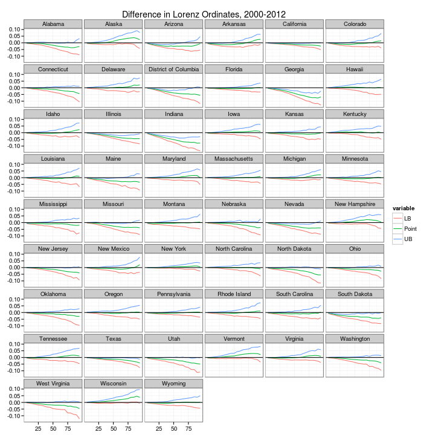
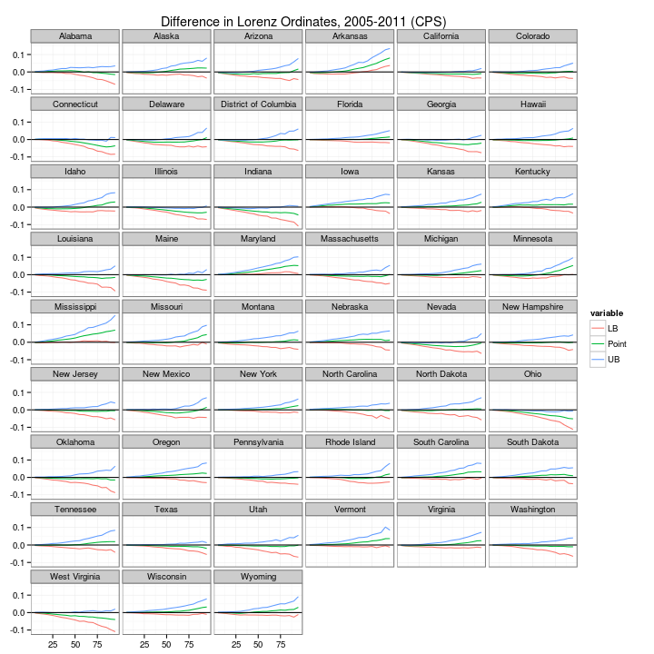
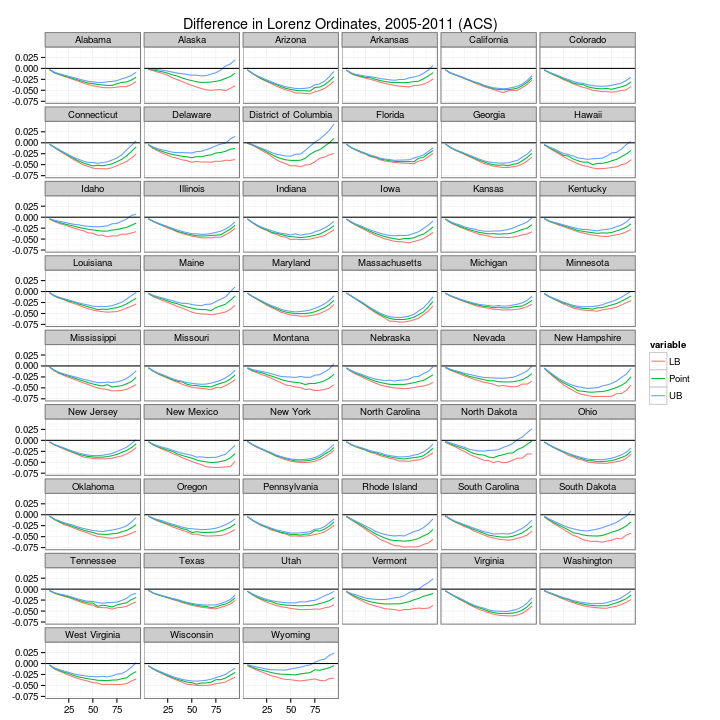
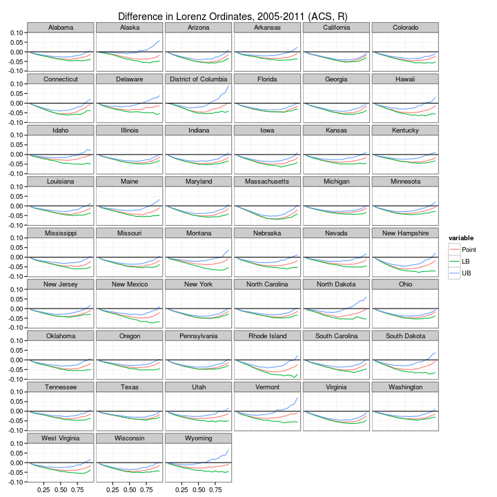

Lorenz Curve Bootstrap inference
========================================================

Our setting is thus: we have survey samples of household income for two periods, $F_1\left(y\right), F_2\left(y\right)$. We want to do inference on whether there has been an increase in inequality between the two periods. To do this, we can compare Lorenz curves. Recall that $L_1\left(p\right) = \frac{1}{\mu_1}\int_{0}^y f\left(x\right)dx$ (i.e. the cumulative share of the bottom $100\left(1-p\right)$ of the income distribution.) It is easy to show that $\frac{dL_1}{dp}=\frac{y_1}{\mu_1}$ where as before $y_1=F_1^{-1}\left(p\right)$. So our object of interest is $L^\Delta = L_2\left(p\right)-L_1\left(p\right)$, and its first derivative. In general, if $L_2\left(p\right)-L_1\left(p\right)\leq 0,\forall p$, then $F_1$ Lorenz dominates $F_2$. 

Much of the literature on inequality, following Piketty and Saez (2003) has focused on the role of the top 1% in driving changes in income distribution. In our setting, a pure top incomes story requires both negative $L^\Delta$ and negative $\frac{dL^\Delta}{dp}$ for all $p \leq 0.99$ (with $L^\Delta$ achieving a local minimum at $p=0.99$). Which is to say, the cumulative share of the top 1% has increased, and _only_ the top 1% were relatively better off in the second period. A second story which is compatible with a weaker reading of the top incomes story would require negative $L^\Delta$ but not necessarily negative derivatives. In this case,  $p_0 = \argmin_p L^\Delta$  delineates the winners and losers on the income distribution. So, for $p>p_0$, people are relatively better off in period 2, and for $p<p_0$ they are relatively worse off. Any case where $L^\Delta\geq 0$ for any $p>0.99$ is evidence against the top incomes story.

In order to do formal inference, we use a semi-parametric bootstrapping technique using CPS survey data. Since incomes are top-coded in the CPS microdata files, we adopt a modification in the spirit of Jenkins, et al (2011). We take bootstrap samples of the non-topcoded observations as per usual nonparametric bootstrap practice, and take draws from a fitted Generalized Beta II distribution for the topcoded observations to estimate $L^*_{2,i}-L^*_{1,i}$, and use the full non-topcoded sample and the same draws from the GB2 distribution to estimate $\hat{L}_{2,i} - \hat{L}_{1,i}$. We repeat this for $i=1,...,n$, and we calculate our point estimate $\frac{1}{n}\sum_{i=1}{n}\left(\hat{L}_{2,i} - \hat{L}_{1,i}\right)$, which is the same as multiple imputation estimate from Jenkins, et al (2011), and form a confidence interval by selecting bounds $\left\lbrace L^*_{\alpha/2}, L^*_{1-\alpha/2}\right\rbrace$, i.e. the $\alpha/2$ and $1-\alpha/2$ quantiles of the empirical bootstrap distribution of  $L^*_{2,i}-L^*_{1,i}$.

This bootstrapping process is quite computationally intensive, so we've offloaded the actual calculation externally. We proceed with some analysis of the results. First, consider the difference in Lorenz curves from 2000 to 2012.


```r
# packages
library(ggplot2)
library(reshape)
```

```
## Loading required package: plyr
## 
## Attaching package: 'reshape'
## 
## The following objects are masked from 'package:plyr':
## 
##     rename, round_any
```

```r
setwd("/media/john/Shared Linux_Windows Files/MSA Level Inequality/")
CPS.work <- read.csv("Data/CPS_LC_semipar0012.csv")
CPS.work$X <- NULL
CPS.work.p <- CPS.work[, c(1, 2, 4, 6)]
CPS.work.ci <- CPS.work[, 1:5]
CPS.work.p[which(CPS.work.p$State == "Alabama"), ]
```

```
##      State ord     Point  pval
## 1  Alabama   5 -0.001914 0.058
## 2  Alabama  10 -0.002508 0.162
## 3  Alabama  15 -0.003208 0.206
## 4  Alabama  20 -0.003649 0.346
## 5  Alabama  25 -0.004251 0.320
## 6  Alabama  30 -0.005757 0.254
## 7  Alabama  35 -0.008249 0.206
## 8  Alabama  40 -0.011855 0.116
## 9  Alabama  45 -0.014101 0.098
## 10 Alabama  50 -0.018044 0.056
## 11 Alabama  55 -0.022286 0.040
## 12 Alabama  60 -0.025536 0.034
## 13 Alabama  65 -0.028937 0.044
## 14 Alabama  70 -0.031655 0.046
## 15 Alabama  75 -0.032030 0.056
## 16 Alabama  80 -0.035938 0.044
## 17 Alabama  85 -0.036412 0.060
## 18 Alabama  90 -0.032002 0.082
## 19 Alabama  95 -0.027750 0.098
```


This will of course be slightly easier to comprehend graphically. Let's look at all the states at once:

```r
CPS.work.ci <- melt(CPS.work.ci, id.vars = c("State", "ord"))
print(ggplot(CPS.work.ci, aes(x = ord, y = value, group = variable, colour = variable)) + 
    labs(title = "Difference in Lorenz Ordinates, 2000-2012") + xlab(NULL) + 
    ylab(NULL) + theme(axis.text.x = element_text(angle = 60, size = 12)) + 
    theme_bw() + geom_line() + geom_hline(aes(yintercept = 0)) + facet_wrap(~State, 
    ncol = 6))
```

 


Now consider 2005-2011 (We will be able to compare this to the ACS later).


```r
setwd("/media/john/Shared Linux_Windows Files/MSA Level Inequality/")
CPS.work <- read.csv("Data/CPS_LC_semipar0512.csv")
CPS.work$X <- NULL
CPS.work.ci <- CPS.work[, 1:5]
CPS.work.ci <- melt(CPS.work.ci, id.vars = c("State", "ord"))
print(ggplot(CPS.work.ci, aes(x = ord, y = value, group = variable, colour = variable)) + 
    labs(title = "Difference in Lorenz Ordinates, 2005-2011 (CPS)") + xlab(NULL) + 
    ylab(NULL) + theme(axis.text.x = element_text(angle = 60, size = 12)) + 
    theme_bw() + geom_line() + geom_hline(aes(yintercept = 0)) + facet_wrap(~State, 
    ncol = 6))
```

 


What about the ACS, come to think of it?


```r
setwd("/media/john/Shared Linux_Windows Files/MSA Level Inequality/")
CPS.work <- read.csv("Data/ACS_LC_semipar0511.csv")
CPS.work$X <- NULL
CPS.work.ci <- CPS.work[, 1:5]
CPS.work.ci <- melt(CPS.work.ci, id.vars = c("State", "ord"))
print(ggplot(CPS.work.ci, aes(x = ord, y = value, group = variable, colour = variable)) + 
    labs(title = "Difference in Lorenz Ordinates, 2005-2011 (ACS)") + xlab(NULL) + 
    ylab(NULL) + theme(axis.text.x = element_text(angle = 60, size = 12)) + 
    theme_bw() + geom_line() + geom_hline(aes(yintercept = 0)) + facet_wrap(~State, 
    ncol = 6))
```

 

(This shows the same figure generated in R instead of Python):

```r
setwd("/media/john/Shared Linux_Windows Files/MSA Level Inequality/")
load("Data/ACS_cellmean_semipar_LC0511_full19.rda")

CPS.work.ci <- ACS_results[, c(1:3, 5:6)]
CPS.work.ci <- melt(CPS.work.ci, id.vars = c("State", "ord"))
print(ggplot(CPS.work.ci, aes(x = ord, y = value, group = variable, colour = variable)) + 
    labs(title = "Difference in Lorenz Ordinates, 2005-2011 (ACS, R)") + xlab(NULL) + 
    ylab(NULL) + theme(axis.text.x = element_text(angle = 60, size = 12)) + 
    theme_bw() + geom_line() + geom_hline(aes(yintercept = 0)) + facet_wrap(~State, 
    ncol = 6))
```

 

